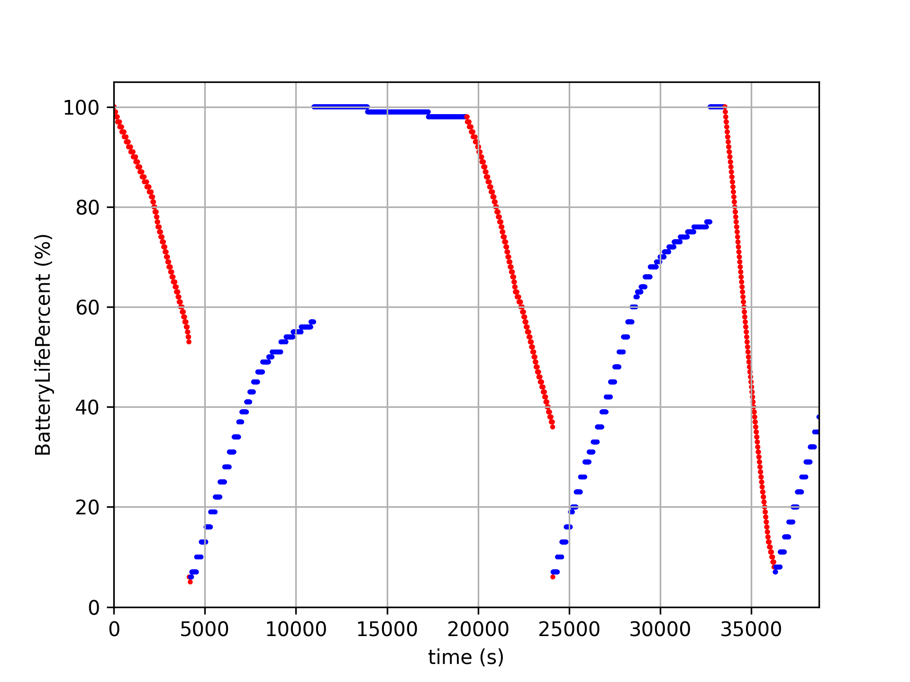
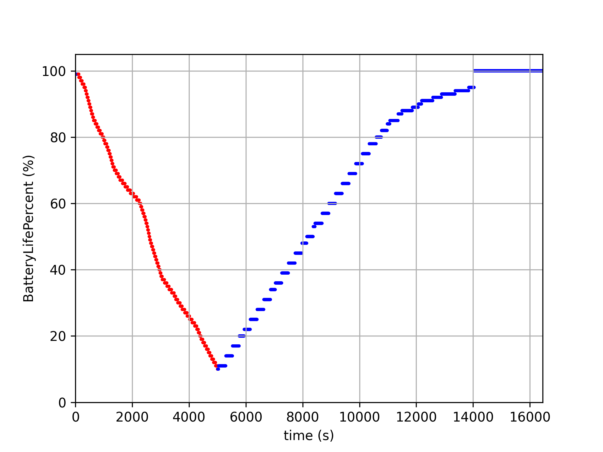

# PyBattery
Laptop Battery Logger

### Requirements
* python3
* `pip install -r requirements.txt`

### Usage
#### Logger
`python logger.py`  
edit logger.py to change log filename and delay for logs.
#### Viewer
`python view.py`  
edit view.py to change log filename.  
* red dots = ac line off
* blue dots = ac line on

### Notice
Require [GetSystemPowerStatus](https://docs.microsoft.com/en-us/windows/win32/api/winbase/nf-winbase-getsystempowerstatus) function, only compatible with Microsoft Windows operating system.

### Example
New battery with an unknown problem.

[logs](PyBatteryLog01.csv)

A complete cycle.

[logs](PyBatteryLog02.csv)
